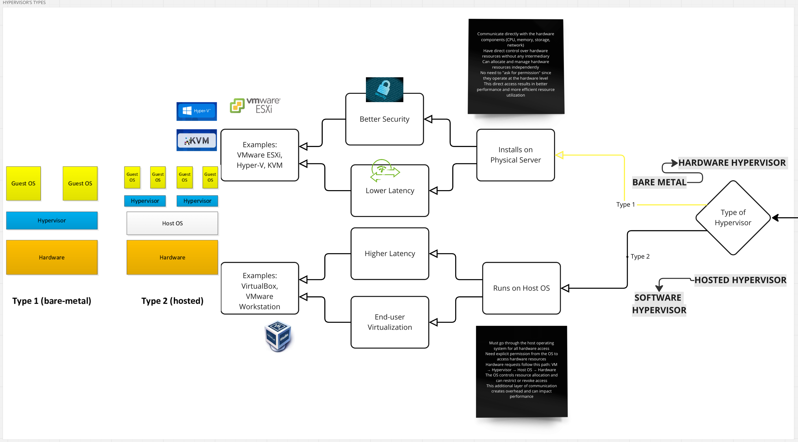
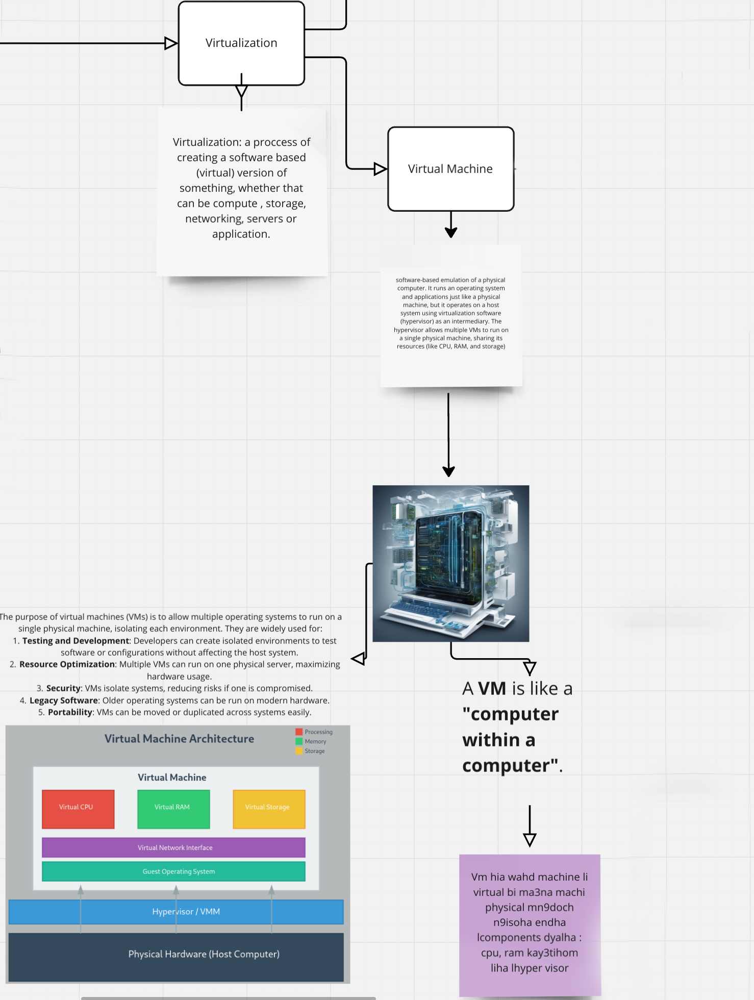
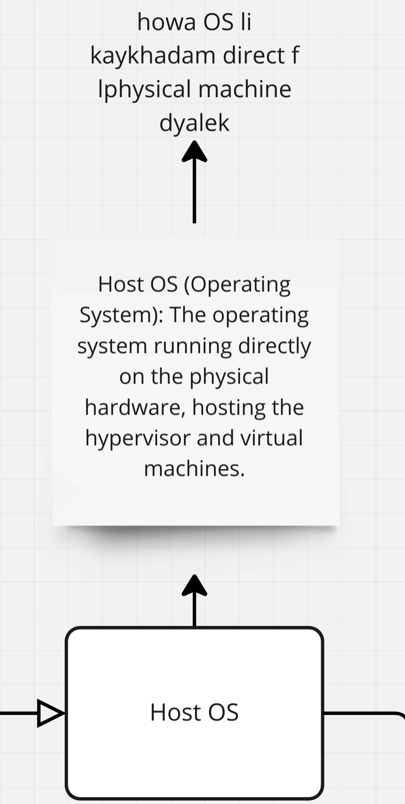
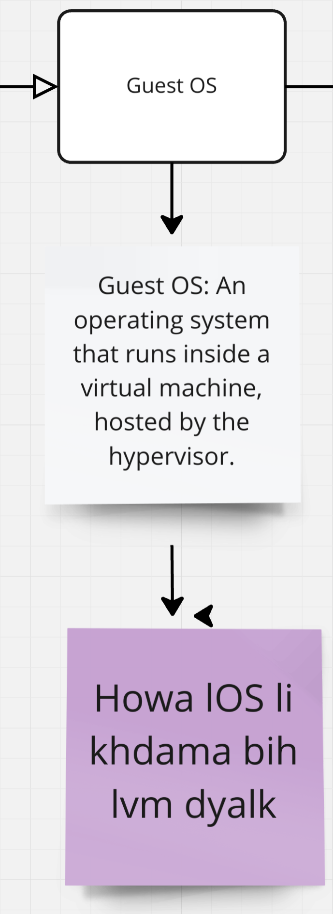

# Project : Born2beRoot

Here is the link to my BornToBeRoot board, where I noted what I learned during this project: ---> [BornToBeRoot Board]([https://miro.com/app/board/uXjVLzBvyb8=/?share_link_id=54254928097](https://miro.com/app/board/uXjVLzBvyb8=/?share_link_id=54254928097))

---

## 1 . Understanding Virtualization
### -> Learning Key Terms :
##### - Hypervisor

##### - Virtual Machine (VM)

##### - HOST OS

##### - Guest OS

##### 📝 Action: Research and Install VirtualBox or UTM

---

## 2 . Install Your Operating System

---