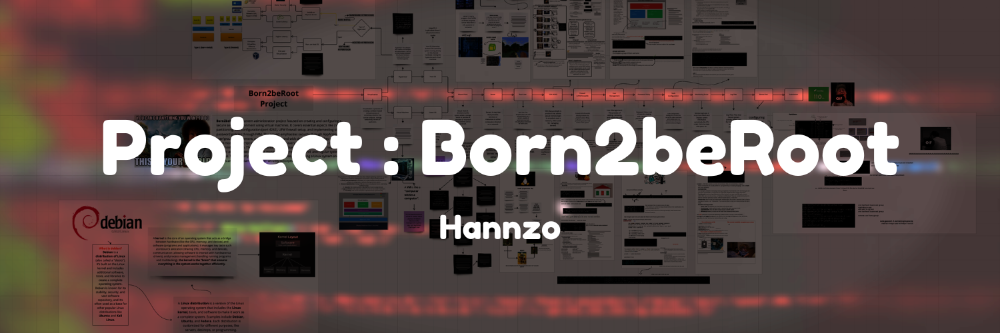
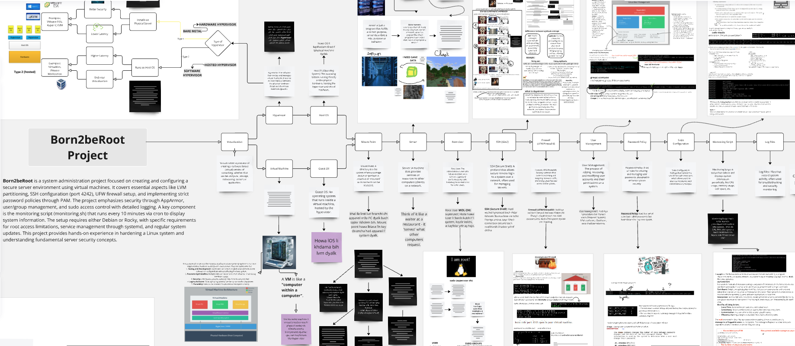

# Project : Born2beRoot

|\
|\
|\
|
- Here is the link to my BornToBeRoot board, where I noted what I learned during this project: ---> [BornToBeRoot Board](https://miro.com/app/board/uXjVLzBvyb8=/)

|\
|\
|\
|

---
## 1 . Understanding Virtualization
### - > Learning Key Terms :
- Hypervisor
- Virtual Machine (VM)
- HOST OS
- Guest OS
### 📝 Action: Research and Install VirtualBox or UTM

---
## 2 . Install Your Operating System
### - > Choose OS: Debian or Rocky Linux
### 📝 Action: Create a VM and install the selected OS

---
## 3 . Learn Linux Command Line Basics
### - >  Key Commands:
- **ls ,  cd ,  mkdir ,  rm ,  cp ,  mv**
### - > Understand File Permissions:
- **chmod ,  chown ,  chgrp
### 📝 Action: Practice basic commands in the terminal

---
## 4 . Set Up Your Server
- No GUI: Do not install a graphical interface
- SSH Configuration: Set on port 4242, disable root
- Firewall Setup: Use UFW (Debian) or firewalld (Rocky)
### 📝 Action: Configure SSH and firewall settings

---
## 5 . Implement Security Measures
- User Management: Create user, set policies
- Password Policy: Expiration, complexity
- Sudo Configuration: Limit attempts, log actions
- Action: Configure user accounts and security policies
---
## 6 . Learn About LVM
- Understand Logical Volume Management
### 📝 Action:Practice creating encrypted partitions using LVM

---
## 7 . Create the Monitoring Script
- Script Requirements: Display system info every 10 mins
- Key Metrics: OS architecture, CPU/RAM usage, disk usage
### 📝 Action: Write and test the monitoring.sh script

---
## 8 . Explore Bonus Tasks
- Additional Services: WordPress or other useful services
### 📝 Action: Research and implement bonus tasks

---
## 9 . Testing and Troubleshooting
- Test Configurations: Verify SSH, firewall, scripts
### 📝 Action: Diagnose issues using logs

---
## 10 . Final Submission
- Signature File: Create signature.txt
### 📝 Action: Follow submission guidelines

---

## Full Born2beRoot Roadmap png : 

