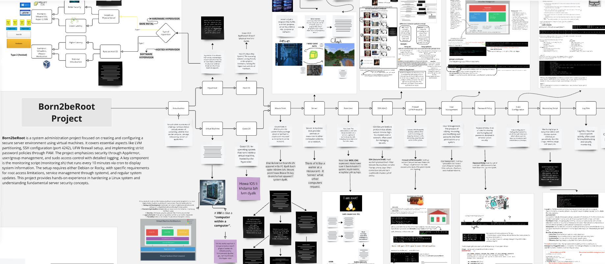

# 🖥️ Born2beRoot

> A complete introduction to system administration, virtualization, and server hardening.

## 🏗️ System Architecture
This project focuses on building a secure, headless virtual machine from scratch, exploring the fundamentals of operating systems and virtualization.
*   **Virtualization:** Configured a secure VM, establishing a clear understanding of Hypervisors, Host OS, and Guest OS interactions.
*   **Storage Management:** Implemented Logical Volume Management (LVM) to create flexible, encrypted partitions for data security.
*   **Headless Operation:** Deployed the server entirely without a Graphical User Interface (GUI) to minimize the system's resource footprint and attack surface.

## 🛡️ Security & Access Control
Hardening the server was a primary objective, requiring strict policy enforcement across the entire system.
*   **SSH Configuration:** Secured remote access by changing the default port to `4242` and strictly disabling direct root login.
*   **Firewall Rules:** Configured the system firewall (UFW/Firewalld) to restrict incoming traffic and only allow essential connections.
*   **Strict Sudo Policies:** Customized the `sudoers` file to limit login attempts, restrict paths, and log every executed action.
*   **User Management:** Enforced robust password expiration and complexity rules to ensure strong authentication standards.

## 📊 System Monitoring
Developed a custom Bash script (`monitoring.sh`) scheduled via `cron` to automatically broadcast system health metrics to all active terminals every 10 minutes.
*   **Hardware Metrics:** Actively tracks CPU utilization, RAM usage, and available disk space.
*   **Network & State:** Displays the OS architecture, current active network connections, and MAC addresses.
*   **Security Tracking:** Verifies if LVM is active and tracks the total number of executed `sudo` commands.

## 🗺️ Learning Roadmap
To visualize the concepts learned during this project—from basic Linux file permissions (`chmod`, `chown`) to advanced virtualization structures—check out my complete mind map: 
* View my Born2beRoot Visual Board Here ---> [BornToBeRoot Board](https://miro.com/app/board/uXjVLzBvyb8=/)

## Full Born2beRoot Roadmap png : 

